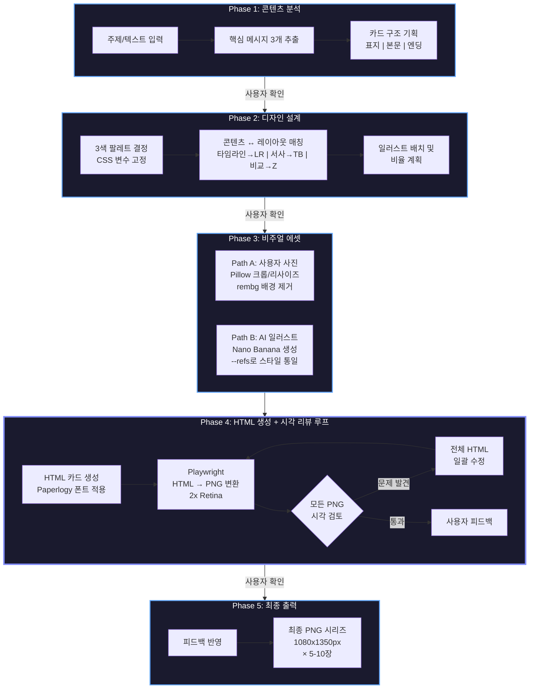

<div align="center">


# Card News Generator

**Claude Code Plugin**

전문 디자이너 수준의 카드뉴스를 AI로 생성합니다.

Instagram 4:5 (1080x1350px) | 2x Retina 출력 | 5-10장 시리즈

[](LICENSE)
[](https://code.claude.com)
[](https://python.org)


</div>


---

## 이런 결과물을 만듭니다

> "카드뉴스 만들어줘"라고 말하면, Claude가 주제 분석부터 디자인, 일러스트 생성, HTML 코딩, 시각 리뷰, PNG 변환까지 **전 과정을 자율적으로 수행**합니다.

### 입력

어떤 주제든 텍스트로 전달하면 됩니다 — 뉴스 기사, 보고서, 아이디어 메모, URL 등.

### 출력

- **5-10장의 PNG 이미지** (1080x1350px, 2x Retina 해상도로 실제 2160x2700px)
- 표지 → 본문 카드 → 엔딩 카드의 완성된 시리즈 구조
- AI 일러스트레이션 또는 사용자 사진을 활용한 비주얼
- Instagram, 블로그, 프레젠테이션에 바로 사용 가능

### 다른 카드뉴스 도구와 비교

HTML/CSS를 사용한 카드뉴스 제작 Claude 플러그인은 시중에 많습니다. 하지만 전문 디자인 원칙이 내재되고, 이미지 생성-처리-제거 도구가 유기적으로 통합된 플러그인은 없습니다.

| | 일반 카드뉴스 플러그인 | **Card News Generator** |
|---|---|---|
| **디자인 품질** | 기본 HTML/CSS 레이아웃 | 페이퍼로지 디자인 철학이 암묵지로 내재 |
| **일러스트** | 스톡 이미지 또는 미지원 | Nano Banana로 AI 생성 + 시리즈 전체 스타일 일관성 |
| **사진 처리** | 단순 삽입 | Pillow 크롭/리사이즈/합성 + rembg 배경 제거 |
| **이미지 편집** | 미지원 | Nano Banana 편집 모드로 색보정, 스타일 변환 |
| **레이아웃** | 고정 그리드 | 콘텐츠 의미에 맞는 동적 레이아웃 선택 |
| **품질 관리** | 한 번 생성하고 끝 | 생성 → 시각 리뷰 → 수정 **자동 반복 루프** |
| **타이포그래피** | 시스템 폰트 1-2개 | Paperlogy 9단계 웨이트 (100-900) |
| **해상도** | 1x | 2x Retina (2160x2700px 실제 출력) |

---

## 왜 다른가: 디자인 철학

이 플러그인에는 [페이퍼로지(Paperology)](https://www.youtube.com/@Paperology) 디자인 교육 채널의 전문 디자인 원칙이 **암묵지(tacit knowledge)**로 내재되어 있습니다. 단순한 프롬프트 규칙이 아니라, 반복적인 생성-리뷰-수정을 거쳐 검증된 실전 노하우입니다.

<table>
<tr>
<td width="50%">

### 핵심 원칙

- **강조는 빼기로** — 키워드에 색을 입히는 대신, 나머지를 회색으로 낮춤
- **테슬라 룰** — 제목은 주제가 아닌 결론 ("기온과 습도" ✕ → "25도와 60%가 핵심" ○)
- **밀도가 품질** — 캔버스의 85-95%를 채움 (과도한 여백 = 미완성)
- **3색 규율** — 주색 + 강조색 + 중성색, 80:20 비율 엄수

</td>
<td width="50%">

### 시리즈 완성도

- **캐릭터 일관성** — 첫 카드 이미지를 레퍼런스로 전체 시리즈 통일
- **북엔딩** — 표지와 엔딩의 시각적 톤 매칭, 비전 문장으로 마무리
- **코너 앵커** — 페이지 번호, 브랜드명, 날짜로 4모서리 고정
- **폰트 웨이트 위계** — 카드당 최대 3 웨이트, 대비로 계층 생성

</td>
</tr>
</table>

<details>
<summary><strong>참고 영상 (페이퍼로지)</strong></summary>
<br>

<a href="https://www.youtube.com/watch?v=nfFjSMrq2LE&t=325s">
  
</a>
<a href="https://www.youtube.com/watch?v=JqVACfUDXNg&t=247s">
  
</a>
<a href="https://www.youtube.com/watch?v=r4Feu3qku5M&t=183s">
  
</a>

</details>

---

## 작동 방식

5단계 워크플로우를 통해 주제 분석부터 최종 PNG 출력까지 자동으로 진행됩니다. 각 단계 전환 시 사용자에게 확인을 요청합니다.



> Phase 4의 **시각 리뷰 루프**가 핵심입니다. Claude가 생성한 PNG를 직접 읽고 평가하여, 밀도-사이징-일관성 문제를 자동으로 수정합니다. "한 번 만들고 끝"이 아닌 **자기 검토 반복**이 품질의 차이를 만듭니다.

### 도구 역할 분담

이 플러그인은 4가지 이미지 처리 도구를 **목적에 따라 분담**하여 사용합니다. 각 도구가 가장 잘하는 영역만 담당하고, 서로의 빈틈을 메웁니다.

| 영역 | 도구 | 역할 |
|------|------|------|
| 정밀한 수치 작업 | **Pillow** | 크롭, 리사이즈, 합성, 그레이스케일, 밝기/대비 조정 |
| 창의적 AI 편집 | **Nano Banana** | 이미지 생성, 색보정, 스타일 변환, 배경 확장 |
| 렌더링 시점 효과 | **CSS Filters** | 밝기, 대비, 세피아, 블러, 색조 회전 |
| 배경 제거 | **rembg** | ML 기반 누끼 따기, 투명 PNG 생성 |

---

## 기술 스택

| 도구 | 역할 | 상세 |
|------|------|------|
| **Claude Code** | 오케스트레이터 | 전체 워크플로우 자율 수행, 디자인 의사결정, 시각 리뷰 |
| **Nano Banana** (Google Gemini) | AI 이미지 생성 | 텍스트→이미지, 이미지 편집, 멀티 레퍼런스, 배치 처리 |
| **Playwright** | HTML→PNG 변환 | Chromium 기반, 2x Retina (2160x2700px 실제 출력) |
| **Pillow** | 기계적 이미지 처리 | 크롭, 리사이즈, 그레이스케일, 밝기/대비, 콜라주 합성 |
| **rembg** | 배경 제거 | ML 기반 누끼 따기, 투명 PNG 생성 |
| **Paperlogy** | 타이포그래피 | 9단계 웨이트 (100-900), 한글 최적화 |
| **HTML/CSS** | 카드 렌더링 | 1080x1350px 고정 뷰포트, CSS 변수 시스템, 인라인 SVG |

---

## 사전 요구사항

- **Claude Code** v1.0.33 이상 ([설치 가이드](https://code.claude.com/docs/en/quickstart))
- **Python** 3.x
- **Google API Key** — [Google AI Studio](https://aistudio.google.com/apikey)에서 발급 (Nano Banana / Gemini용)
- 인터넷 연결 (API 호출 및 Chromium 설치)

---

## 설치

### 1단계: 플러그인 설치

**마켓플레이스에서 설치:**

```bash
# Claude Code 내에서 실행
/plugin marketplace add seongjin-design/card-news
```

**또는 로컬에서 직접 테스트:**

```bash
# 저장소 클론
git clone https://github.com/seongjin/card-news.git

# Claude Code에 로컬 플러그인으로 등록
claude --plugin-dir ./card-news
```

### 2단계: 환경 설정

```bash
# 스킬 디렉토리의 스크립트 폴더로 이동
cd .claude/skills/card-news/scripts

# 자동 설정 실행 (venv 생성 + 의존성 설치 + Chromium 설치)
bash setup.sh
```

### 3단계: API 키 설정

`.claude/skills/card-news/scripts/.env` 파일에 Google API 키를 입력합니다:

```env
# Google API Key (필수)
GOOGLE_API_KEY=your_api_key_here

# 선택 설정 (기본값 사용 가능)
GOOGLE_MODEL=gemini-3.1-flash-image-preview
IMAGE_SIZE=2K
```

### 4단계: 설치 확인

```bash
# Claude Code 내에서 플러그인 리로드
/reload-plugins

# 스킬 호출로 정상 작동 확인
/card-news:card-news 테스트 카드뉴스 만들어줘
```

---

## 사용 예시

Claude Code에서 자연어로 요청하면 됩니다.

### 기본 사용법

```
"인공지능의 미래에 대한 카드뉴스 만들어줘"
```

```
"이 기사를 카드뉴스로 정리해줘: [기사 텍스트 또는 URL]"
```

```
"우리 회사 신제품 소개 인포그래픽을 만들어줘"
```

### 사진 활용

```
"이 사진들을 활용해서 여행 카드뉴스를 만들어줘"
(사진 파일 경로 제공)
```

### 스타일 지정

```
"어두운 톤의 시사 카드뉴스로 만들어줘 — 주제는 기후변화"
```

```
"밝고 캐주얼한 느낌으로 카페 추천 카드뉴스 만들어줘"
```

### 레퍼런스 이미지 활용

```
"이 디자인 스타일을 참고해서 카드뉴스 만들어줘"
(레퍼런스 이미지 경로 제공)
```

> 카드뉴스, 인포그래픽, SNS 콘텐츠, 요약 카드, 슬라이드 디자인, 비주얼 설명 등 **시각 콘텐츠 생성과 관련된 모든 요청**에 자동으로 활성화됩니다.

---

## 프로젝트 구조

```
card-news/
├── .claude-plugin/
│   ├── plugin.json              # 플러그인 메타데이터 (name, version, keywords)
│   └── marketplace.json         # 마켓플레이스 등록 정보
│
├── .claude/skills/card-news/
│   ├── SKILL.md                 # 핵심 스킬 문서 (5단계 워크플로우 + 디자인 원칙)
│   │
│   ├── scripts/
│   │   ├── generate_image.py    # Nano Banana API (텍스트→이미지, 편집, 멀티레퍼런스, 배치)
│   │   ├── html_to_png.py      # Playwright HTML→PNG 변환 (2x Retina)
│   │   ├── process_photo.py    # Pillow 이미지 처리 (크롭, 리사이즈, 합성, 색보정)
│   │   ├── setup.sh            # 원클릭 환경 설정 스크립트
│   │   ├── requirements.txt    # Python 의존성 목록
│   │   └── .env                # API 키 설정 (git에서 제외됨)
│   │
│   ├── assets/fonts/
│   │   ├── Paperlogy-1Thin.ttf      # 웨이트 100
│   │   ├── Paperlogy-2ExtraLight.ttf # 웨이트 200
│   │   ├── Paperlogy-3Light.ttf     # 웨이트 300
│   │   ├── Paperlogy-4Regular.ttf   # 웨이트 400
│   │   ├── Paperlogy-5Medium.ttf    # 웨이트 500
│   │   ├── Paperlogy-6SemiBold.ttf  # 웨이트 600
│   │   ├── Paperlogy-7Bold.ttf      # 웨이트 700
│   │   ├── Paperlogy-8ExtraBold.ttf # 웨이트 800
│   │   ├── Paperlogy-9Black.ttf     # 웨이트 900
│   │   └── 그리운 사막의 연우체.ttf    # 포인트용 감성 폰트
│   │
│   └── references/              # 심화 참고 문서
│       ├── design-principles.md     # 페이퍼로지 디자인 철학 상세
│       ├── css-patterns.md          # 카드뉴스 CSS 패턴 모음
│       ├── image-prompt-guide.md    # Nano Banana 프롬프트 작성법
│       └── photo-processing-guide.md # 사진 처리 도구 선택 가이드
│
├── README.md
└── LICENSE
```

---

## 스크립트 레퍼런스

> Claude가 자동으로 호출하는 도구들입니다. 직접 실행할 필요는 없지만, 구조를 이해하면 커스터마이징에 도움이 됩니다.

### generate_image.py — AI 이미지 생성

```bash
# 텍스트에서 이미지 생성
python generate_image.py --prompt "설명..." --output out.png --aspect-ratio 4:5

# 기존 이미지 편집 (80% 만족 시 재생성 대신 편집)
python generate_image.py --prompt "색감을 따뜻하게" --input photo.png --output edited.png

# 멀티 레퍼런스 (스타일 일관성 유지)
python generate_image.py --prompt "같은 스타일로..." --refs card1.png style.png --output card2.png

# 배치 처리 (병렬 실행)
python generate_image.py --batch batch.json
```

### html_to_png.py — HTML을 PNG로 변환

```bash
# 디렉토리 내 모든 HTML 일괄 변환
python html_to_png.py ./outputs/

# 단일 파일 변환
python html_to_png.py card.html --output card.png
```

### process_photo.py — 사진 처리

```bash
# 4:5 비율로 스마트 크롭
python process_photo.py --crop 4:5 --input photo.jpg --output cropped.png

# 리사이즈
python process_photo.py --resize 1080x1350 --input photo.jpg --output resized.png

# 밝기/대비 조정
python process_photo.py --brightness 0.7 --contrast 1.3 --input photo.jpg --output adj.png

# 멀티 레이어 콜라주 합성
python process_photo.py --composite layout.json --output collage.png
```

### rembg — 배경 제거

```bash
# 단일 이미지 배경 제거
rembg i input.png output.png

# 디렉토리 일괄 처리
rembg p input_dir/ output_dir/
```

---

## 커스터마이징

### 폰트 추가

`assets/fonts/` 디렉토리에 `.ttf` 또는 `.otf` 파일을 추가하고, `SKILL.md`의 폰트 관련 섹션을 수정하면 Claude가 새 폰트를 인식합니다.

### 디자인 원칙 조정

`references/design-principles.md`를 수정하면 Claude의 디자인 의사결정 기준이 바뀝니다. 예를 들어, 밀도 기준을 85-95%에서 70-80%로 변경하면 더 여유 있는 레이아웃이 생성됩니다.

### 새로운 CSS 패턴 추가

`references/css-patterns.md`에 새로운 레이아웃 패턴이나 효과를 추가하면 Claude가 디자인 시 활용합니다.

---

## 크레딧

### 디자인 지식

- **[페이퍼로지 (Paperology)](https://www.youtube.com/@Paperology)** — 이 플러그인의 디자인 철학과 원칙의 근간이 된 한국어 디자인 교육 채널. "강조는 빼기로", "테슬라 룰", "밀도가 품질" 등의 핵심 원칙은 페이퍼로지의 강의에서 추출하여 암묵지로 내재화한 것입니다.

### 기술

- **[Nano Banana (Google Gemini)](https://ai.google.dev/)** — AI 이미지 생성 및 편집 엔진
- **[Playwright](https://playwright.dev/)** — 브라우저 기반 고품질 렌더링
- **[Pillow](https://python-pillow.org/)** — Python 이미지 처리 라이브러리
- **[rembg](https://github.com/danielgatis/rembg)** — ML 기반 배경 제거

### 폰트

- **[Paperlogy](https://noonnu.cc/font_page/1337)** — 9단계 웨이트를 지원하는 한글 고딕 서체

---

## 라이선스

이 프로젝트는 [MIT 라이선스](LICENSE)에 따라 배포됩니다.

---

<div align="center">

**Card News Generator** — 디자인 원칙을 코드로 구현하다

Made with Claude Code

</div>
